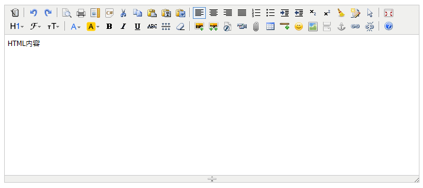
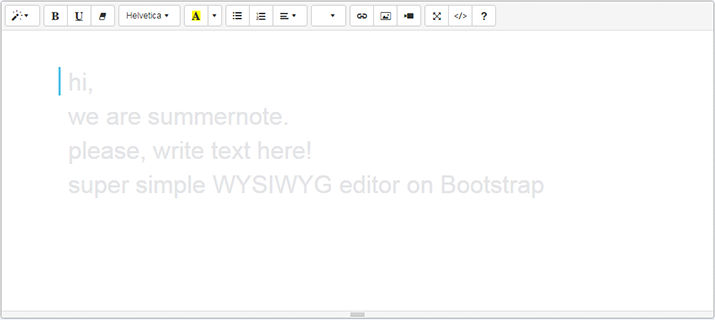

Laravel5-MultiEditor
---------
Laravel5-MultiEditor 是基于 Kindeditor/Summernote 等的富文本在线HTMl编辑器，支持 Laravel5 项目。已集成本地、七牛云、阿里云文件存储。

## 更新记录

* 2019-02-28 `Release v1.0.0` 完成 KindEditor/Summernote 在线编辑器主程序，且集成本地、七牛、阿里云oss存储。

## 安装流程

1、安装的两种方式

① 直接编辑配置文件

将以下内容增加到 composer.json：

```json
require: {
    "chenhua/laravel5-multi-editor": "~1.0"
}
```

然后运行 `composer update`。

② 执行命令安装

运行命令：

```bash
composer require chenhua/laravel5-multi-editor
```

2、完成上面的操作后，修改 `config/app.php` 中 `providers` 数组

```php
Chenhua\MultiEditor\MultiEditorServiceProvider::class,
```

3、执行 `artisan` 命令，拷贝静态文件

```bash
php artisan vendor:publish --tag=multi_editor
```

## 使用方法

### 在 `xxx.blade.php` 编辑器相应位置添加如下代码：

① Kindeditor 编辑器

```html
<textarea id="editor_id" name="content" style="width:700px;height:300px;">
    HTML内容
</textarea>

@include('editor::kindeditor',['editor'=>'#editor_id'])
```
> 以上操作能生成一个 `id="editor"` 的 `HTML` 文本编辑框，并能实时预览效果.

更多用法可以参考 `KindEditor` 官方文档，[解锁更多姿势>>>](http://kindeditor.net/doc.php)

② Summernote 编辑器

```html
<textarea id="editor">sdfdsfd</textarea>
@include('editor::summernote',['editor'=>'#editor'])
```

### 效果展示

Kindeditor 样式：


Summernote 样式：


## License
本扩展遵循 [MIT license](http://opensource.org/licenses/MIT) 开源。


